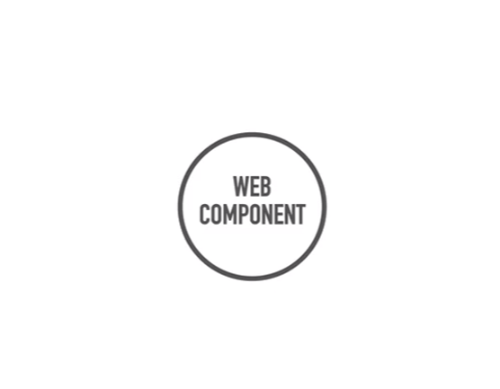
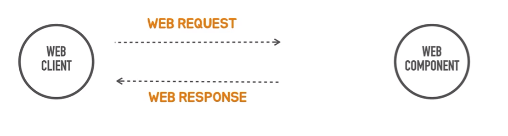
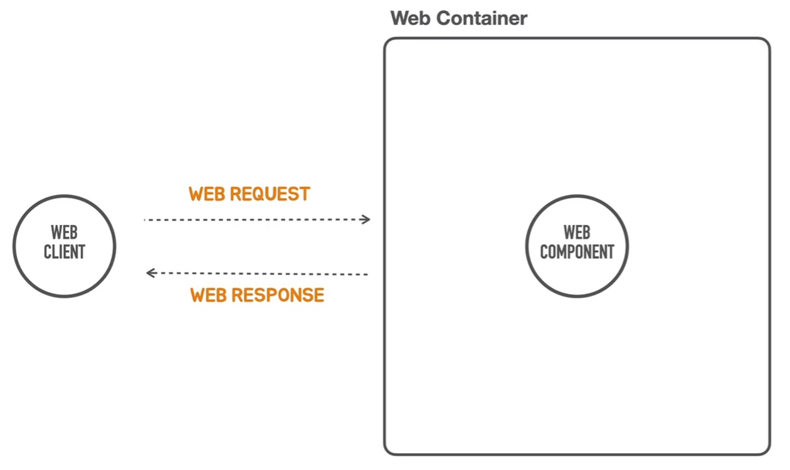
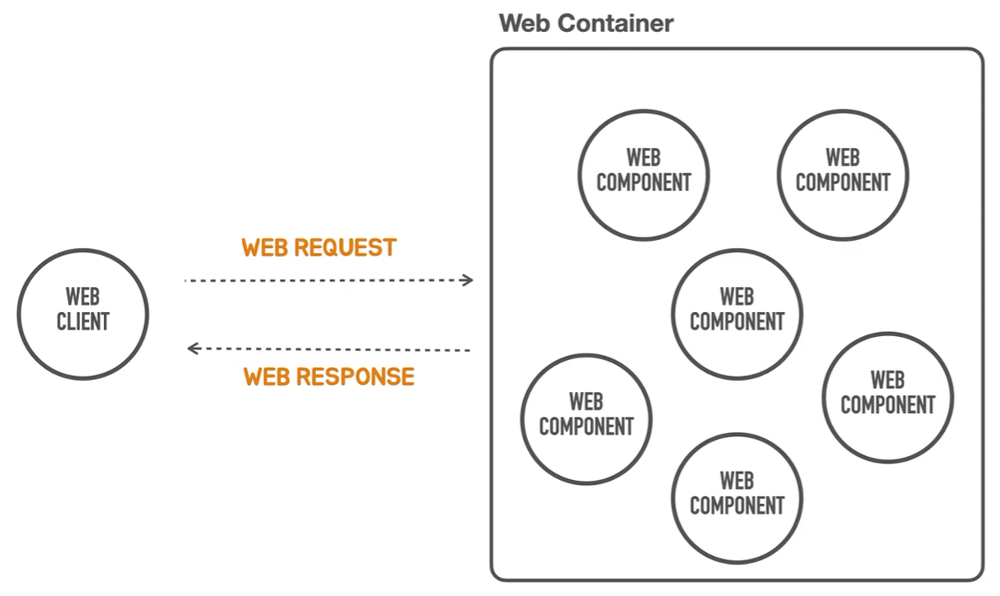
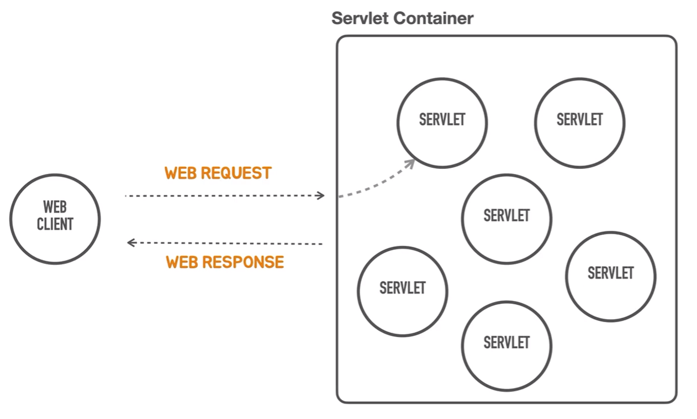
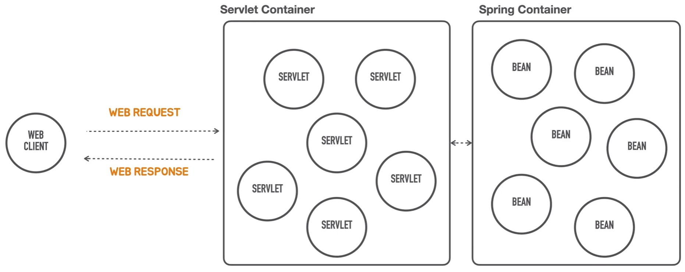
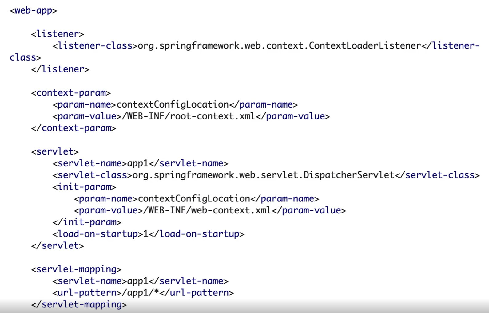
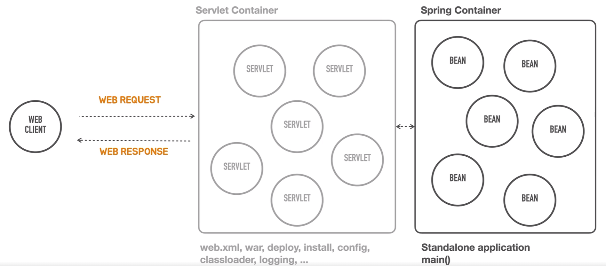

# Containerless
```text
스프링 부트는 컨테이너리스 웹 애플리케이션 아키텍처를 스프링이 지원해줬으면
좋겠다는 개발자의 요청으로 부터 출발했습니다.
```
컨테이너리스라고 생각해보면 컨테이너가 필요없다는 의미로 생각할 수 있지만,  
Serverless와 유사합니다. 서버에 대한 설치 관리 이런 부분을 개발자들이 신경을 쓰지 않고,  
서버 애플리케이션을 개발해서 배포하고 운영하는 게 가능하도록 만드는 방법을 서버리스라고 부르는데  
컨테이너리스도 그거와 비슷한 것이라고 생각할 수 있습니다.  

정리하면,  
_**컨테이너가 없는 컨테이너 관리를 신경쓰지 않아도 된다**_  
  
이런 얘기를 하려면, 여기서 말하는 컨테이너가 무엇인지 알아야 합니다.  
도커 컨테이너 혹은 다른 컨테이너 기술을 생각할 수 있습니다.  
스프링도 IOC 컨테이너입니다. 스프링 컨테이너라고 부르기도 하죠  
스프링 프레임워크인 스프링 컨테이너를 쓰지 말자는 뜻인가 생각할 수 있습니다.  
 
## 컨테이너가 무엇일까?  
우리가 웹 프로그램을 개발한다는 것은 서버에서 동작하면서 기능을 제공해주는 여러가지 컴포넌트를 만드는 것입니다.  
<div style="text-align: center;"></div>

웹 컴포넌트 하나를 만들었다고 합시다.  
예를 들어서 회원 가입 기능을 담당하는 웹 컴포넌트를 만들었어요.  
이렇게 웹 컴포넌트는 서버에 존재하게 될 텐데 얘 혼자서는 일을 할 수 없습니다.  

<div style="text-align: center;"></div>

**웹 컴포넌트는 항상 웹 클라이언트가 필요합니다.**  
웹 클라이언트가 웹 컴포넌트에게 요청을 주면 그때 웹 컴포넌트가 일을 하기 때문입니다.  

웹 컴포넌트가 하는 주요한 일은  
여러가지 일을 할 수 있지만, 핵심적인 목표는 다이나믹 콘텐츠를 만드는 겁니다.  
  
만약 매번 바뀌는 콘텐츠가 아닌 항상 고정되어 있는 똑같은 페이지를 띄운다면,  
굳이 웹 컴포넌트를 만들지 않습니다.  
웹 서버위에 정적인 어떤 리소스를 올려놓고 항상 똑같은 화면을 보여주면 되기때문입니다.  

<div style="text-align: center;"></div>  
웹 컴포넌트를 만든다는 것은 이 안에 코드를 작성하여 도적인 콘텐츠를 만들어서  
웹 클라이언트에게 응답으로 매번 다른 결과를 응답으로 보내주는거죠  
그래서 웹은 항상 요청과 응답이 쌍으로 돌아가게 되어있고,  
그 요청을 처리하는 하나의 혹은 하나 이상의 웹 컴포넌트가 존재하고,  
그 웹 컴포넌트의 주요한 일은 동적인 컨텐츠를 만들어 응답을 해주는 겁니다.  

그런데 웹 컴포넌트는 서버에 혼자 있을수 없습니다.  
_**항상 웹 컴포넌트는 웹 컨테이너 안에 들어가 있어야 합니다.**_  

## 웹 컨테이너란 ?  
<div style="text-align: center;"></div>
웹 컨테이너는 1차적으로 웹 컴포넌트를 관리하는 역할입니다.  
웹 컴포넌트가 서버 쪽에 떠 있는거니까 시작을 시켜줘야하는데, 얘를 누군가 생명주기(생성,소멸등)를 관리해야 합니다.  
컴포넌트를 메모리에 올리고, new 생성자를 통해서 진입되는 클래스의 인스턴스를 생성해주고  
웹 프로세스가 서비스되는 동안 계속 메모리 위에서 동작하도록 관리해주는 작업이 필요합니다.  
이렇게 흔히 이야기하는 라이프 사이클 관리,일생 주기를 관리하는 그런 역할을 하는게  

_**컨테이너의 첫번째 작업입니다.**_  

또 하나 중요한 것은 웹 컨테이너는 일반적으로 하나의 웹 컴포넌트만 가지고 있지 않습니다.  
하나의 웹 컨테이너가 제공하는 서비스를 담당하는 컴포넌트들이 여러개 있을수 있습니다.  
회원가입,탈퇴,로그인,조회등이 필요하죠.  
여러 기능을 가진 웹 컴포넌트들을 웹 컨테이너가 다 관리를 해줘야 합니다.
<div style="text-align: center;"></div>  

웹 컨테이너가 또 해줘야하는 중요한 역할은 클라이언트로부터 들어온 요청을 어느 컴포넌트가 담당할지 결정해주는 작업을 해야합니다.  
그래서 웹 요청이 들어오면 웹 컨테이너는 정해진 어떤 룰에 따라서 해당 컴포넌트에게 요청을 넘겨줍니다.  
어떤 컴포넌트가 웹 요청을 처리할지 결정하는 것 그리고 그것을 선택하는 작업을 우리는 흔히  
_**라우팅 또는 맵핑이라고 합니다**_  

스프링에서 핸들러 매핑이라고 하는 이런 것들이 웹 요청을 담당하는 컴포넌트를 결정해주는 거죠.  
우리가 웹 컴포넌트라고 얘기하는데 이걸 자바 용어로 `Sevlet`이라고 부릅니다.  
이 `sevlet`을 관리하는 컨테이너를 `sevlet container`라고 부릅니다.
<div style="text-align: center;"></div>  

#### 잠깐 정리를 하면
```text
웹 클라이언트가 웹 컴포넌트에게 요청하고, 응답받을수 있게 컴포넌트를 관리하는 역할을 웹 컨테이너가 한다.
웹 컨테이너는 웹 컴포넌트의 생명주기(Life cycle)을 관리하며,
웹 컴포넌트는 자바 용어로 Sevlet이라고 한다.
웹 클라이언트의 요청을 알맞은 컴포넌트에 연결하는것을 우리는 라우팅,맵핑이라고 한다.
```  

우리가 제일 잘 아는 Servlet Container는 `Tomcat`같은게 있습니다.  
그래서 이 안에 `Sevlet`을 여러개 띄워놓고 그 다음에 매핑정보(XML)를 집어넣으면  
요청에 따라서 확정 서블릿이 그 요청을 처리할 수 있도록 그리고 응답을 생성해서  
다시 클라이언트(웹 브라우저,API를 호출한 클라이언트)한테 되돌려주는 작업을 담당하는 `Sevlet`이 있고,  
그런 웹 컴포넌트(`Sevlet`)을 관리하는 컨테이너가 존재합니다.  

_**이 방식이 전통적인 자바의 웹 프로그래밍 기본 구성입니다.**_  

그리고 이 서블릿에 대해서 좀 더 나은 방법으로 개발을 할 수 있도록 도와주는 것들 중에서  
하나가 바로 _**스프링 프레임워크**_ 입니다.  
 
그러면 스프링도 IOC 컨테이너라고 했는데,  
`Sevlet Container`인 톰캣을 대체해서 스프링 프레임워크를 사용하는건 아닙니다.  
<div style="text-align: center;"></div>  
  
스프링 컨테이너는 뒤쪽에 존재합니다.  
서블릿 컨테이너의 뒤쪽에 있으면서 얘도 똑같이 어떤 기능을 담당하는 컴포넌트들을 스프링 컨테이너에서 관리합니다.  
스프링 컨테이너에서 관리하는 컴포넌트를 우리는 `Bean`이라고 부릅니다.  

정리하면,  
```text
스프링 컨테이너는 서블릿 컨테이너 뒤에 위치합니다.
웹 클라이언트가 요청을 하면 서블릿 컨테이너가 매핑된 서블릿 객체를 통해서 웹으로 들어욘 요청을 받습니다.
그걸 다시 스프링 컨테이너에게 넘겨주면 스프링 컨테이너는 여기에 맞는 빈에게 전달합니다.
하나의 빈이 작업하는 동안에 다른 기능이 필요하면 이 작업을 다른 빈에게 위임을 하기도 합니다.
```  
_**스프링 컨테이너 안에서 우리가 만든 웹 애플리케이션이 동작하게 됩니다.**_  

그러면, 스프링 컨테이너가 아예 서블릿 컨테이너를 대체하면 좋지 않을까?  
_**그건 안됩니다.**_  
기본적으로 자바의 표준 웹 기술을 사용하려면 서블릿 컨테이너는 반드시 존재해야합니다.  
  
개발자는 스프링을 통해 비즈니스 로직을 개발하는 것에만 집중해서  
빈들을 어떻게 구성하고, 이것을 스프링 컨테이너에서 관리할지 고민을 하면 편할텐데  
이것을 동작시키려면 가장 간단한 `hello world`를 띄우는 프로그램을 동작하게 하려면  
무조건 이 서블릿 컨테이너를 서버에서 동작시켜야 합니다.  

<div style="text-align: center;"></div>  
  
서블릿 컨테이너는 굉장히 오래된 기술이고, 많은 것을 포용하려고 하다보니  
여러가지 다양한 설정 방법을 요구하게 됩니다.  
예전에는 위 이미지과 같이 서플링 매핑을 디스패처 서블릿과 해야하고,  
여러가지 설정을 작성해야지 서블릿 컨테이너가 동작하고, 스프링 컨테이너가 호출이 됩니다.  

서블릿 컨테이너,스프링 컨테이너까지 포함해서 이 전체 서블릿 컨테이너 위에 돌아가는 애플리케이션은  
그 확장자가 WAR 웹 애플리케이션 아카이브라고하는 형식의 파일로 빌드가 되어야하고,  
빌드를 한다하면 빌드 툴의 플러그인을 사용하면 되지만,  
중요한건 폴더 구조도 중요하게 됩니다.  
`WEB-INF`밑에 클래스를 어디다 집어넣고, jar 라이브러리는 어디 폴더 아래에 넣고  
프로젝트 폴더 구성도 추가로 작성해야합니다.  

이렇게 준비되어도 실제로 서블릿 컨테이너는 독립적인 서버 프로그램이기 때문에  
`Tomcat` 같은 것을 우리가 받아서 우리 환경에 맞게 설치를하고 실행을 시켜야합니다.  
그리고 여기다가 만들어진 WAR파일로 압축된 서블릿 어플리케이션을 배포하는 작업도 해야합니다.  
배포하는 방식도 다양하고, 방법도 알아야합니다.  

또한 서블릿 컨테이너에 여러가지 설정을 추가로 작성해줘야합니다.  
  
서블릿 컨테이너의 표준 기술이고 다양한 구현체가 있기 때문에  
다른 서블릿 컨테이너 기술을 사용하게 되면 새로 학습을 해야하고,  
학습해서 유용하지도 않고, 프로젝트가 한번 끝나면 기억하지 못하기 때문에  
다음 프로젝트를 할때 다시 찾아봐야 합니다.  

_**서블릿 컨테이너를 아예 안쓰고 어떻게 스프링 컨테이너가 웹 요청을 받을 수 있을까?**_  
라는 이야기는 아니고 자바 웹 요청 표준인 서블릿 컨테이너는 필요하고 사용하지만,  
설치와 관리를 개발자가 시간을 들여서 학습하고 적용하는 수고를 제거해 줬으면 한다는 겁니다  

컨테이너리스를 적용하게되면  
<div style="text-align: center;"></div>  

이렇게 동작하게 됩니다.  
실제로는 서블릿 컨테이너가 동작을 합니다.  
서블릿 컨테이너가 동작하기 위해서 필요로 하는 설정 정보들을 알아서 스프링 부트가 제공합니다  

_**서블릿 컨테이너 설정을 알지 못해도 일단 개발을 시작하고 동작시킬수 있도록 합니다.**_  
물론 서블릿 컨테이너를 우리가 원하는 방식으로 커스터마이징을 할 수 있는 방법도 제공합니다.  
스프링을 개발하는데 웹 컨테이너를 몰라도 빈을 스프링 컨테이너에 등록하고,  
스프링을 사용할줄 안다면 웹 환경에서 동작하는 스프링 애플리케이션을 만들고 사용할 수 있게 됩니다.  

## 컨테이너리스  
스프링 부트가 웹 컨테이너리스를 적용하는 방법입니다.  
웹 컨테이너 설정은 스프링 부트가 설정한 방식으로 자동으로 만들어주고,  
웹 환경 애플리케이션을 동작시키려면 서블릿 컨테이너를 한 번은 띄워야 하는데  
이것도 스프링 부트를 이용하면 어떤 클래스의 메인 메소드를 호출하면  
이 전체가 동작하는 방식으로 개발을 할 수 가 있습니다.  

_**이것을 독립 실행형 애플리케이션 혹은 스탠드 얼론 애플리케이션이라 부릅니다.**_  
실제로 만들어보면 스프링 부트에는 항상 메인 메소드가 등장합니다.  
그것만으로 서블릿 컨테이너와 관련된 모든 필요한 설정과 실행작업을 하게 됩니다.  
이것이 컨테이너리스 개발 방법입니다.