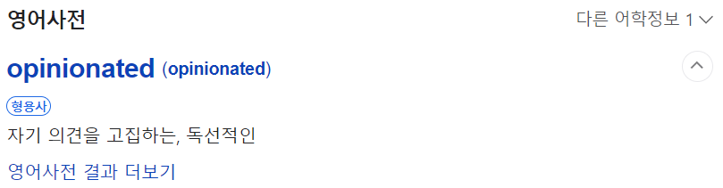
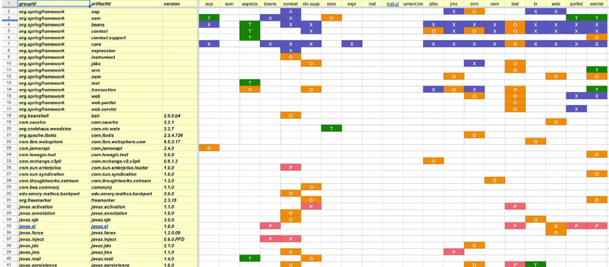

# Opinionated
> 스프링 부트를 소개하는 문장 혹은 스프링 부트의 목표에 빠지지 않은 단어입니다.  

  

#### 스프링 부트는 왜 자기 자신을 이렇게 소개할까?  
스프링 부트는 프로젝트를 시작할 때 고민을 하지말고 우리가 다 결정해줄게!  
너는 고객에게 필요한 소프트웨어의 도메인,거기에 충실한 기능을 개발만 하라는 이야기입니다.  

## 스프링 프레임워크의 설계 철학
+ 극단적인 유연함 추구
+ 다양한 관점을 수용
+ Not opinionated
+ 수많은 선택지를 다 포용  
   
스프링은 다양한 기술을 교체하면서 사용할 수 있지만, 너가 만든 애플리케이션 코드는  
영향을 받지 않는다는게 스프링의 기본적인 철학입니다.  

자바 생태계의 특징인데 여기서 제공하는 다양한 특징들,장점들을 전부 수용하겠다는 의미입니다.  
스프링 레퍼런스 메뉴얼의 앞부분에 보면 스프링 부트와 달리 _**not opinionated**_ 라는 표현이 나옵니다.  
스프링은 우리 주장을 강하게 고집하지 않는다는 뜻이죠.  
  
이게 장점이지만, 실제로 스프링 프레임워크를 사용하는 개발자들은 직접 선택해야합니다.  
그래서 새로운 프레임워크를 이용한 프로젝트를 시작할 때 어떤 기술을 사용해야 될지  
고민하는 시간이 필요로 하고, 그걸 잘못하면 나중에 불편한 상황이 생기기도 합니다.  

그러면, 스프링 부트의 철학은 무엇이냐면  
+ Opinionated - 자기 주장이 강한, 독선적인
+ 우리가 정해주는 대로 개발을 시작해
+ 스프링을 잘 활용하는 뛰어난 방법을 제공  
  
우리가 그런 기술적인 고민들을 하지 않도록 많은 걸 정해줄 테니까  
애플리케이션을 개발하는 거를 빠르게 진행할 수 있게 도와줍니다.  
스프링과 스프링 관련된 기술들을 사용하는 수 많은 방법들이 있지만  
지금까지 10년, 20년 동안 그런 기술들이 사용되어 지면서 이렇게 쓰는게 `베스트 프랙티스`라고  
생각한 그런 방법들이 있는데 일단 그걸 제안해 줄테니 그거부터 출발해서 개발을 해보자는 겁니다.  
  
이게 스프링 부트의 설계 철학입니다.  
  
그렇다면 Spring boot가 결정해주는 건 무엇일까?  
Spring boot가 결정해주는 것은 우리가 만들고자 하는 애플리케이션에서 사용하는 기술이 어떤건지,  
그 다음에 구체적으로 어떤 라이브러리를 사용할 것인가, 그리고 어떤 버전을 사용할 것인지  
이런 것들을 결정해 줍니다.  

**그게 어려운 건가?**  

그냥 JPA를 사용하고 웹 사용하고 대충 그럴건데? 라고 생각할 수 있지만,  
그 안에 굉장히 많은 선택지가 있습니다. 똑같은 기능을 제공하는 API를 가지고 있지만  
다양한 종류의 구현체들이 있고 각각이 장단점과 특징을 가지고 있습니다.  

이러한 여러가지 선택지들 중에서 Spring boot 개발팀이 굉장히 많은 시간동안 고민을 하고,  
검증을 하는 과정을 통해서 결정하고 제안해준 그런 표준 구성들이 있습니다.  

예를 들어,  

우리가 JPL을 사용하겠다.  
그러면 엔진은 뭘 쓸 것이고, 그 다음에 거기에 따라오는 의존 라이브러리들이 있는데  
이런 부분에 대한 구성등을 기본적으로 다 만들어서 제공해줍니다.  

  
  
그때 `Spring Core Framework`안에 들어있는 각 모듈이 실제로 사용하고 있는 라이브러리들이 어떤 것들이 있고,  
그 다음에 이게 필수인가 아니면 런타임 시에만 사용되어지는 것인가 아니면 어떤 기능을 사용하면 이 라이브러리까지 필요하다.  
이런 부분들 정리해서 사용해야했습니다.  

`Spring Core Framework`외에 다른 생태계인 `Spring Cloud`,`Spring Security`등을 사용할 때에도  
필요로 하는 의존 라이브러리 종류와 버전을 알아야합니다.  
  
스프링 부트는 제일 좋은 것이라고 생각하는 구현체를 우리에게 제공합니다.  
그래서 기술에 대한 고민을 하지 않고, 스프링 부트팀이 검증했으니 믿고 이후의 작업을 진행하면됩니다.  
  
### 사용 기술과 의존 라이브러리 결정
+ 업계에서 검증된 스프링 생태계 프로젝트, 표준 자바 기술,  
    오픈소스 기술읠 종류와 의존관계, 사용 버전을 정해준다.  
+ 각 기술을 스프링에 적용하는 방식(DI 구성)과 디폴트 설정값 제공  
  
꼭 개발자들이 결정하고 넘어가야하는 설정은 비워두긴 하지만 대부분 기본 설정까지 해줍니다.  
  
만약 데이터 저장 기술을 `Hibernate`를 사용한다.  
`Hibernate5`를 사용하다하면, 거기에 맞춰서 설졍해줘야하는 속성 값들 있고,  
그 다음에 트랜잭션도 거기에 호환되는 걸 넣어줘야합니다. 이런 부분들도 다 알고 구성해야합니다.  
우리가 구성을 해야되는데 한 두가지가 아니라는 거죠.  
스프링 부트는 여기까지도 기본적인 작업들을 다 해줍니다.  
DB 연결 정보만 개발자가 세팅을 해놓으면 바로 애플리케이션과 데이터베이스 API등을 사용할 수 있습니다.  
  
스프링 부트가 많은 것들을 결정해주기 때문에 얻는 혜택이 많습니다.  
  
그런데, 이런 식으로 프로젝트를 시작할 때 많은 부분들을 자동으로 세팅해주는 기술이 많습니다.  
나중에 커스터마이징으로 확장하기위해 고치는 순간 장점들이 많이 사라지는 경우가 있습니다.  
  
그리고 코어 기술 자체를 업그레이드하면 호환성이 다 깨지기도 합니다.  
  
스프링 부트는 굉장히 유연한 방식으로 사용자가 변경하고 싶은 설정이 생기면  
스프링 부트를 우리가 만든 어플리케이션 코드를 거의 수정하지 않고 조금씩 제거하고  
모든 것을 우리가 지정하는 방식으로 재구성할 수도 있습니다.  
  
우리가 만든 모듈도 Spring boot가 제공하는 모듈처럼 기술과 구성을 미리 지정해두고  
이걸 간편하게 확장할 수 있도록 만드는 방법도 제공합니다.  
