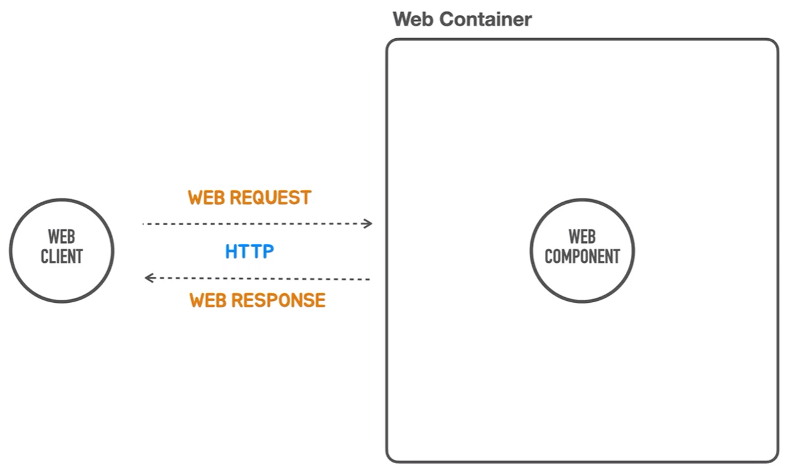

# HTTP 요청과 응답
<div style="text-align: center;"></div>  

웹 클라이언트가 웹 요청을 웹 컨테이너에게 보내면 웹 컨테이너는 이 요청을 처리할 웹 컴포넌트를 찾아  
요청을 위임하고 웹 컴포넌트는 요청을 분석한 다음 필요 작업을 수행하고 결과를 만들어 냅니다.  
그 만들어진 결과가 다시 웹 응답으로 웹 클라이언트에게 리턴이 되는거죠.  

이때 중요한건 _**웹 클라이언트와 웹 컨테이너 사이에 요청과 응답이 항상 쌍을 맺어서 수행됩니다.**_  
  
요청이 없는 응답은 없습니다.  
웹 요청은 어떤 식으로 보내고 응답은 어떻게 받아야 되는지 정의해 놓은 표준 기술이 있습니다.  
그것을 우리는 `HTTP`라고 부릅니다.  
클라이언트와 서버간의 통신 프로토콜이기 때문에 `HTTP`에 대해 공부를 해야합니다.  

## HTTP 요청과 응답의 구조  
> HTTP 요청과 응답의 구조는 꼭 기억해야합니다.  
> 뒤에서 웹 애플리케이션을 개발할 때 요청과 응답의 각 요소들을 어떻게 가져올 수 있고  
> 어떻게 생성할 수 있는지 생각하면서 개발해야하기 때문입니다.  
  
그리고 내가 개발한 웹 프로그램이 동작할 때 어떤 기능을 수행하는 동안에 어떤 요청이 들어왔고,  
어떤 응답이 만들어졌는지 이걸 HTTP를 모니터링하는 도구같은 걸 사용해서  
실제 주고 받는 요청과 응답 내용을 보면서 기대했던 대로 바르게 요청과 응답이 만들어지고  
이걸 사용하는지 확인할 수 있어야합니다.  

### Request
+ Request Line: Method, Path, HTTP Version  
+ Headers  
+ Message Body

요청의 첫 줄에는 어떤 메소드(행위)를 이용하겠다는 메소드가 제일 먼저 등장합니다.  
`GET`,`POST`등 잘하는 HTTP 메소드가 제일 앞에 나옵니다.  
그 뒤에 URL 호스트 네임과 포트를 제외한 나머지 경로 부분이 `PATH`에 작성됩니다.  
이제 `Query String`으로 파라미터 값이 전달 될 수도 있습니다.  
마지막에는 HTTP 버전이 붙어서 나옵니다.  

요청의 헤더 정보에는 여러가지 중요한 정보들이 들어갑니다.  
이 헤더에 들어가 있는 정보에 따라서 요청을 처리하는 방식이 달라지거나  
아니면 응답을 생성할 때 타입 같은 것들이 바뀌기도 합니다.  
그래서 헤더 정보들을 필요한 경우에 꺼내서 사용하거나 확인할 수 있어야 합니다.

마지막으로 이제 `POST`나 `PUT`같은 메세지 바디가 동반되는 요청이 있습니다.  
그 경우에는 헤더에 설정된 `content-type`에 맞는 메세지 바디 부분이 제일 마지막 부분에 작성됩니다.

### Response
+ Status Line: HTTP Version, Status Code, Status Text  
+ Headers  
+ Message Body

응답은 첫 줄만 다르고 나머지 부분은 요청의 `HTTP`구조와 유사합니다.  
첫 줄은 `HTTP version`이 제일 앞에 나오고 제일 중요한 _**상태코드**_ 가 있습니다.  
중요한 이유는 상태코드가 `500`을 리턴할 경우 클라이언트는 서버내에서 문제가 발생했구나  
또 상태코드가 `4XX`가 올 경우 내가 보낸 요청 자체에 어떤 문제가 있다는 것을 확인할 수 있습니다.  
그리고 이걸 설명하는 텍스트가 뒤에 붙기도 합니다.  
  
응답도 마찬가지로 헤더에 제일 중요한 것은 메세지 바디가 어떠한 `content-type`으로 작성이 되어있는지  
이 정보는 반드시 들어가야합니다.  
그 외에 서버가 클라이언트에게 보내주고 싶은 정보들을 헤더에 추가 될 수 있습니다.  

먼저 요청 HTTP를 다시 살펴보면
```text
GET /hello?name=Spring HTTP/1.1
Accept: */*
Accept-Encoding: gzip, deflate
Connection: keep-alive
Host: localhost:8080
User-Agent: HTTPie/3.2.2
```
GET : 서버에 데이터를 가져오기위해 요청을 보냈다는 의미입니다.  
그리고 이어지는 것이 Host 뒤의 경로는 이렇고 파라미터 값이 작성되어 있습니다.  
마지막으로 지금 사용하는 http 버전이 작성되어있습니다.  
  
요청에서 중요한 헤더는 body가 따로 들어가 있지 않다면 _**accept**_ 입니다.  
설정을 하지 않으면 응답으로 오는 모든 컨텐트 타입을 수용하겠다는 의미입니다.
`Accept: */*`가 그런 의미 입니다.  
만약 특정한 타입으로만 받겠다면 구체적으로 명시할수 있습니다.  
클라이언트 요청에 특정한 컨텐트 타입으로 받겠다고 명시할 경우에는  
어떤 컨트롤러라도 컨텐트 타입을 요청한 컨텐트 타입으로 리턴하게 되어있습니다.

```text
$ http -v ":8080/hello?name=Spring" "Accept:text/html"
GET /hello?name=Spring HTTP/1.1
Accept: text/html

HTTP/1.1 200
Content-Type: text/html;charset=UTF-8

Hello Spring
```  
이렇게 같은 컨트롤러이지만 헤더 정보에 따라 응답 컨텐트 타입이 달라질 수 있습니다.  

이제 응답쪽 http를 다시 살펴보면
```text
HTTP/1.1 200
Connection: keep-alive
Content-Length: 12
Content-Type: text/plain;charset=UTF-8
Date:1.1 200
Connection: keep-alive
Content-Length: 12

Hello Spring
```
http 버전과 제일 중요한 상태코드가 첫 줄에 작성됩니다.  
만약 여기에 400번대나 500번대가 리턴하게 된다면 문제가 발생했다는 걸 알 수 있습니다.  
  
이제 헤더에서 중요한건 바디에 `content-type`입니다.  
현재는 컨텐트 타입이 json도 아니고 html도 아닌 text라고 알려주고 있습니다.  

그리고 마지막으로 `content-type`의 body가 제일 마지막에 추가 됩니다.  
저희가 반환했던 `return String`이 그래도 여기에 담겨져 있습니다.  

이제 API를 만들고 테스트를 할 때,  
간단하게 어떤 http 요청과 응답이 오고 가는지 확인해야합니다. 