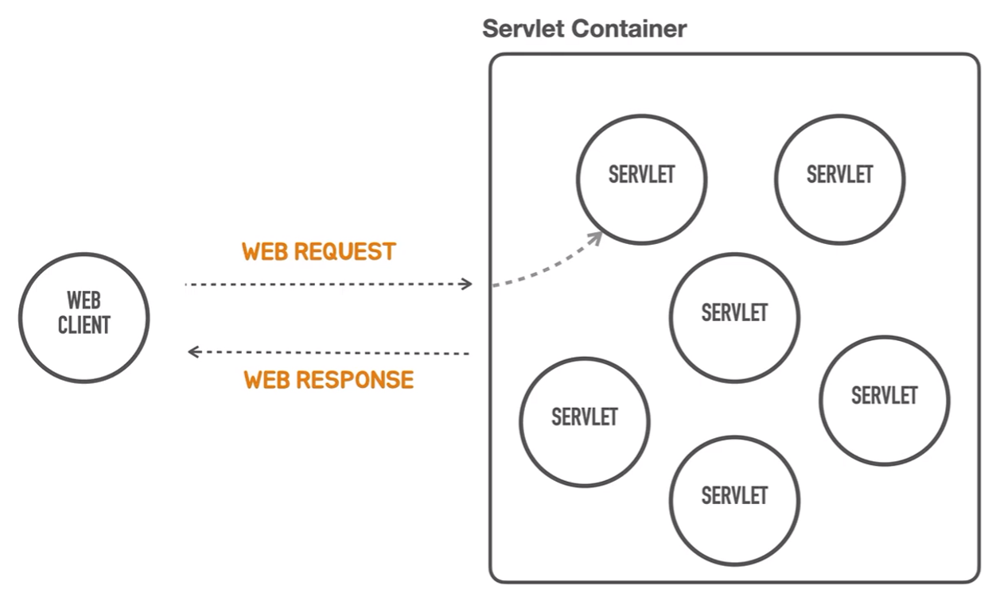
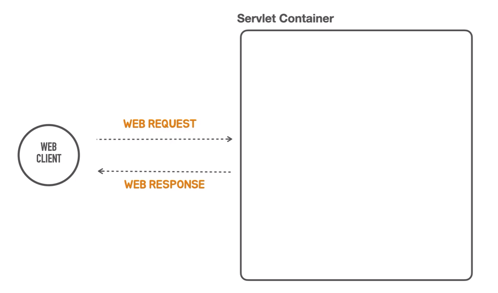

# 서블릿 컨테이너 띄우기 
> 이번 장은 스프링 부트의 컨테이너리스  
> 서블릿 컨테이너와 관련된 번거롭고 복잡한 지식이나 작업을 요구하지 않고  
> 스프링 컨테이너에 들어가 있는 애플리케이션 코드 빈이라고 불리는 컴포넌트 개발에만 집중하고  
> 서블릿 컨테이너와 관련된 설치,배포,관리등의 작업을 신경쓰지 않도록 구성하는 작업을 합니다.  
  
일단 목표는 아래와 같습니다.  
1. 우리의 관심사는 이 서블릿 컨테이너를 직접 설치하지 않고 어떻게 동작하게 만들 것인지  
2. 우리가 여기에 대해서 직접 신경쓰지 않도록 할 것인지  
  
서블릿 컨테이너를 설치하는 대신에 `stand alone` 프로그램을 만들건데  
스탠드 얼론 프로그램에서 이 서블릿 컨테이너를 알아서 띄워주는 작업을 해야합니다.  
<div style="text-align: center;"></div>  

서블릿 컨테이너는 컨테이너니까 이 안에 많은 서블릿이 있어야 합니다.  
그래서 웹 어플리케이션으로 동작하는 건 한 번 점검을 해봐야 되니까 이것만 집중을 하고  
나머지 작업들은 앞으로 재사용해서 신경쓰지 않도록 할 수 있는 코드로 구현을 해볼겁니다.  

<div style="text-align: center;"></div>  
제일 쉬운 것부터 시작을 해보면 일단 서블릿이 없는 서블릿 컨테이너를 코드로 띄워보는 작업을 해봅니다.  
Servlet이라는 것은 자바의 표준 기술이고 이 표준 기술을 구현한 컨테이너 제품이 많이 있습니다  

`Tomcat`을 메인 메소드를 통해서 시작을 해볼 겁니다.  
`Tomcat`은 어떻게 여기에 사용할 수 있고 설치도 하지 않았는데 Tomcat을 띄울거냐면  
`Tomcat`도 Java로 만들었다는 이야기는 어떤 클래스의 오브젝트를 만들고 그 안에 어떤 메소드를 실행하면  
서블릿 컨테이너가 동작하기 시작할 거라는 이야기입니다.  

원래 서버를 설치해서 사용하게 의도했던 톰캣도 있지만, 이 톰캣을 내장(인베디드)해서  
필요한 환경에 사용해도 좋다는 의도를 가지고 내장형 톰캣이라는 라이브러리를 제공합니다.  

스프링 부트를 처음에 프로젝트를 통해서 만들 때 이미 내장형 톰캣은 라이브러리에 포함되어있습니다.  
이제 이걸 호출해서 시작을 합니다.  

```java
public static void main(String[] args) {
    Tomcat tomcat = new Tomcat();
    tomcat.start();
}
```  
이렇게하면 서블릿 컨테이너가 동작하지 않습니다.  
톰캣을 정상적으로 띄우고 서블릿을 하나 구동하게 하기 위해서 준비해야하는 설정이 많습니다.  
Spring Boot가 `TomcatSevletContainer`를 내장해서 프로그램에서 코드로 쉽게 시작해서  
사용할 수 있도록 만들어진 도우미 클래스가 있습니다.  
`TomcatServletWebServerFactory`입니다.  
  
`Factory`라고 이름이 붙은 이유는 `TomcatSevletWebServer`를 만드는 복잡한 생성 과정과 그 다음 복잡한 설정등을  
지원하고 모든 설정을 마친뒤에 `TomcatSevletWebServer`를 생성해 인스턴스를 만들어 달라는 요청이 오면  
그때 인스턴스를 생성해주는 도우미 클래스 입니다.  

```java
public class HelloApplication {

    public static void main(String[] args) {
        TomcatServletWebServerFactory webServerFactory = new TomcatServletWebServerFactory();
        WebServer webServer = webServerFactory.getWebServer();
    }

}
```  
`webServerFactory`의 메소드를 보면 `getWebServer`가 있습니다.  
서블릿 컨테이너를 만드는 생성 함수가 되는겁니다. 요걸 `WebServer`라는 타입으로 받습니다.  
반환 타입에 톰캣이라는 이름이 사라지고 `WebServer`가 나오게 되는데  
이제 스프링 부트가 톰캣외에 제티나 언더토우같은 유명한 서블릿 컨테이너도 지원할 수 있고  
모두 일관된 방식으로 동작하도록 만들기위해 추상화를 했기 때문입니다.  

사실 리턴 타입을 톰캣을 빼고 `SevletWebServerFactory`로 받을 수 있습니다.
```java
@FunctionalInterface
public interface ServletWebServerFactory extends WebServerFactory {
	WebServer getWebServer(ServletContextInitializer... initializers);
}
```
찾아보면 `ServletWebServerFactory`는 `getWebServer`라는 기능을 지원해야하고
여기에 복잡한 설정도 가능하지만 바로 사용 가능한 설정이 되어있습니다.
반환 타입인 `WebSevlet`을 살펴보면 간단한 인터페이스가 있습니다.
```java
public interface WebServer {
	void start() throws WebServerException;
	void stop() throws WebServerException;
	int getPort();
}
```  
이게 특정한 Tomcat이나 Jetty같은 구현체에 종속되지 않게 추상해서 만들었습니다.  
만약 다른 서블릿 컨테이너를 사용하고 싶다면, 구현체만 변경하면 되는겁니다.  
  
이제 반환된 `WebServer`를 실행하면  
```text
22:57:50.247 [main] INFO org.springframework.boot.web.embedded.tomcat.TomcatWebServer - Tomcat started on port(s): 8080 (http) with context path ''
```
톰캣이 동작하는 것을 확인할 수 있습니다.  

이제 8080 포트에 컨택스트 패스 ''에 요청을 보내봅니다.  
```text
$ http -v ":8080"
GET / HTTP/1.1
color:#525D76;} h1 {font-size:22px;} h2 {font-size:16px;} h3 {font-size:14px;} p {font-size:12px;} a {color:black;} .line {height:1px;background-color:#525D76;border:none;}</style></he
ad><body><h1>HTTP Status 404 – Not Found</h1><hr class="line" /><p><b>Type</b> Status Report</p><p><b>Description</b> The origin server did not find a current representation for the ta
rget resource or is not willing to disclose that one exists.</p><hr class="line" /><h3>Apache Tomcat/9.0.82</h3></body></html>
```  
`html`타입으로 응답이 잘 도착했습니다.  
