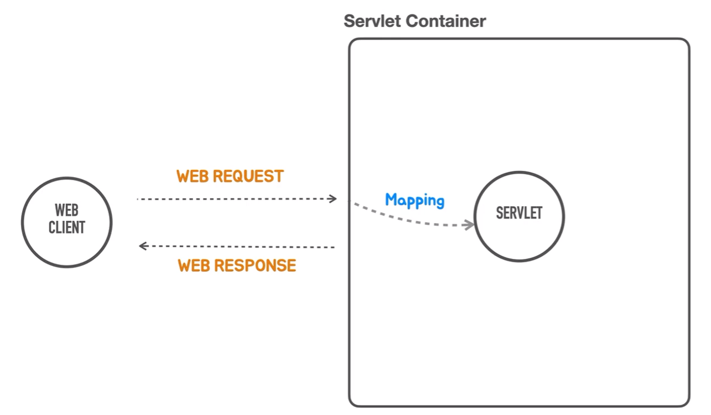

# 서블릿 등록  
<div style="text-align: center;"></div>  

이전 장에서 서블릿이 등록되지 않은 서블릿 컨테이너를 java코드를 통해 띄웠습니다.  
`Embedded Tomcat`을 사용했습니다.  
서블릿은 컨테이너에 여러 개가 들어가게 되어있습니다.  
그리고 서블릿 컨테이너가 웹 클라이언트 요청을 받으면 여러 개의 서블릿중에서  
어떤 서블릿을 호출할지 결정하게 되는데 이 결정하는 작업을 `Mapping`이라 합니다.  

요청이 오면 서블릿 컨테이너가 요청 정보를 확인하고 거기에 맞는 `Mapping`정보를 가진  
서블릿에게 요청을 위임합니다.  
그러면 서블릿이 웹 응답을 만들기 위해 필요로 하는 작업들 수행하고 작업을 종료합니다.  
이제 컨테이너가 다시 웹 클라이언트에게 서블릿이 반환한 결과를 `http`형태로 응답합니다.  

절대 잊으면 안되는 게 있습니다. 

### Request
+ Request Line: Method, Path, HTTP Version
+ Headers
+ Message Body
### Response
+ Status Line: HTTP Version, Status Code, Status Text
+ Headers
+ Message Body

어떠한 종류의 웹 기술을 사용하더라도 웹 표준 프로토콜을 이용해서 요청이 들어오고  
서버가 반환한 응답을 어떻게 클라이언트가 받는지 그게 어떠한 내용으로 구성되는지 알아야합니다.  
이 웹 기술에서는 요청을 이런 식으로 받아서 이렇게 메소드로 전달을 하는구나  
이렇게 매핑하는데 사용을 하는지 빨리 파악해야합니다.  

우리가 코드를 작성하면서 어떻게 응답이 만들어지는지 머리 속으로 생각해야합니다.  
이게 직관적으로 만드는 로우 레벨의 어떤 웹 프로그래밍도 있지만 요즘에는 그것보다  
훨씬 추상화된 방법을 많이 사용해서 코드에서 반환하는 값이 `http body`로 들어가는지  
`http header`가 되는건지 `http status code`가 되는건지 분간을 못할 수도 있습니다.  

스프링 MVC를 마스터하는 중요한 과정중 하는 웹과 관련된 어떤 코드를 볼때마다  
요청과 응답이라는 관점에서 이게 이렇게 연결되는지 알아야합니다.  
새로운 기술을 보면 여기서 요청을 어떻게 가져오고 응답은 어떻게 만드는지 생각해야합니다.  

서블릿을 직접 코드로 사용하는 일은 없겠지만,  
_**서블릿 코드에서 요청과 응답을 어떻게 처리하는지 집중해서 알아야합니다.**_  

ServletContextInitializer라는걸 매개변수로 넣을 수 있는데  
얘의 역할은 SevlertContext를 프로그램에 의해 구성하는 작업에 사용되는 인터페이스고  
서블릿 컨테이너에 Servlet을 등록하는데 필요한 작업을 수행하는 오브젝트를 만드는데 사용된다.  
라고 이해하면 됩니다.  

```java
public class HelloApplication {

    public static void main(String[] args) {
        ServletWebServerFactory webServerFactory = new TomcatServletWebServerFactory();
        WebServer webServer = webServerFactory.getWebServer(
                new ServletContextInitializer(){
                    @Override
                    public void onStartup(ServletContext servletContext) throws ServletException {
                        
                    }
                }
        );
        webServer.start();
    }

}
```
여러번 사용하지 않을거니까 익명클래스로 구현하고, `ServletContextInitializer`가 함수형 인터페이스니까  
람다로 변형해서 사용할 수 있습니다. 
```java
public class HelloApplication {
    public static void main(String[] args) {
        ServletWebServerFactory webServerFactory = new TomcatServletWebServerFactory();
        WebServer webServer = webServerFactory.getWebServer(
                servletContext -> { }
        );
        webServer.start();
    }
}
```
서블릿 컨택스트에는 addSevlet이라는 메소드가 3개가 있는데  
3가지 모두 첫번째 파라미터로 서블릿의 이름을 받고, 그 다음에는 서블릿 클래스 정보를 넣거나  
아니면 서블릿 타입의 오브젝트를 만들어 전달합니다. 우리는 서블릿 오브젝트를 만들어 전달하는 방식을 사용합니다.  
그 전에 작성한 HelloController과 유사하게 동작하도록 만들어 보겠습니다.
```java
servletContext -> {
    servletContext.addServlet("hello", new HttpServlet() {
        @Override
        protected void service(HttpServletRequest req, HttpServletResponse resp) throws ServletException, IOException {
            super.service(req, resp);
        }
    }).addMapping("/hello");;
}
```
HttpServlet을 상속하는 익명 클래스를 만들고 두 번째 파라미터로 전달합니다.  
오버라이딩을 해서 구현하면 되는데 이때 `service()`라는 메소드를 사용합니다.  

여기서 파라미터로 서블릿 컨택스트가 서블릿에 전달하는 것을 살펴보면  
웹 클라이언트의 요청을 서블릿에 위임하기에 전달이 되고,  
그리고 어떤 로직을 수행하고 반환할 때 응답할 객체를 전달하는 것을 확인할 수 있습니다.  
  
추가로 서블릿 컨테이너가 웹 클라이언트 요청을 어느 서블릿에게 위임할지 결정하는 `Mappring`이 필요합니다.  
이 매핑 작업을 추가로 해야합니다.  
`.addMapping("/hello");`기본 매핑은 url을 이용합니다.  
해당 url로 요청이 온 건 해당 서블릿이 처리하겠다는 의미입니다.  

원래는 들어온 요청을 분석하는 과정이 필요하지만 일단 다 생략하고  
응답을 만들어 보겠습니다.  
### Response
+ Status Line: HTTP Version, Status Code, Status Text
+ Headers
+ Message Body
  
응답의 3가지 중요 요소를 다시 확인합니다.  
첫 번째가 상태 코드  
두 번째가 바디가 어떤 타입인지 정의하는 `content-type`을 헤더에 작성해야합니다.  
마지막으로 바디 부분에 응답 결과를 넣습니다.  
```java
resp.setStatus(200);
resp.setHeader("Content-Type","text/plain");
PrintWriter writer = resp.getWriter();
writer.println("hello");
```
HTTP 응답의 3가지 요소가 모두 포함된 응답 객체를 만들었습니다.  
  
서버를 다시 띄우고 `httpie`로 테스트를 해보면 
```text
GET /hello HTTP/1.1           
Accept: */*                   
Accept-Encoding: gzip, deflate
Connection: keep-alive        
Host: localhost:8080          
User-Agent: HTTPie/3.2.2      


HTTP/1.1 200                               
Connection: keep-alive                     
Content-Length: 7                          
Content-Type: text/plain;charset=ISO-8859-1
Date: Sat, 11 Nov 2023 14:50:09 GMT        
Keep-Alive: timeout=60                     

hello
```  
우리가 작성한 상태코드와 컨텐트 타입, 바디가 정상적으로 우리가 작성한대로 동작한걸 확인할 수 있습니다.  
이렇게 서블릿 컨테이너를 직접 설치및 배포를 하지 않고 간단하게  
자바코드로 서블릿 컨테이너를 띄우고 서블릿을 등록하여 동작하는 것을 수행했습니다.  

