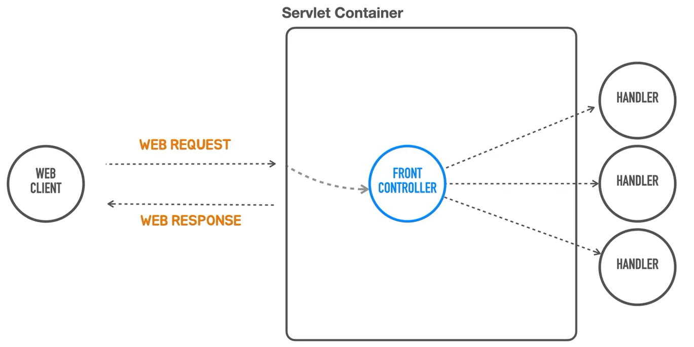

# 프론트 컨트롤러   
> 이전 장에서는 코드로 서블릿 컨테이너를 띄우고 처음에 만들었던 @RestController hello()와 유사한 방식으로  
> 동작하는 코드를 만들고 테스트를 했습니다.  
  
클라이언트 요청에 따라 거기에 맞는 서블릿을 직접 하나씩 매핑을 해야했습니다.  
만약, 회원가입이라면 매핑으로 `POST /user` , 회원탈퇴-`DELETE /user`등등  
요청마다 새로운 서블릿을 만들고, 등록하고 , 매핑하고, requset/response 마다 데이터를 가져오고  
  
하지만 꽤 초기부터 이런 서블릿의 접근 방법을 개선할 필요가 있습니다.  
```java
servletContext.addServlet("hello", new HttpServlet() {
        @Override
        protected void service(HttpServletRequest req, HttpServletResponse resp) throws ServletException, IOException {
            String name = req.getParameter("name");

            resp.setStatus(HttpStatus.OK.value());
            resp.setHeader(HttpHeaders.CONTENT_TYPE, MediaType.TEXT_PLAIN_VALUE);
            // 실제 기능 로직
        }
    }).addMapping("/hello");
}
```  
왜냐하면 서블릿이 여러 개가 되면서 모든 서블릿이 컨테이너로부터 요청을 직접 받아서  
모든 작업을 다 수행하고 리턴하는 방식으로 코드를 만들다보니 위 코드처럼  
대부분의 서블릿에서 필요로로 하는 어떤 공통적인 작업이 각 서블릿 코드 안에서 중복이 되어서 등장합니다.  
요청이 100가지 종류가 있다면, 비슷한 코드가 100군데 서블릿 코드 안에서 중복해서 나타나는 거죠.  

### 요구사항  
1. 여러 개의 서블릿의 중복 코드 제거.  
2. 직접적으로 request object(`HttpServletRequest`)와 response object(`HttpServletResponse`)  
    두 오브젝트를 다뤄야하는 방식이 서블릿 코드내에 작성되는게 자연스럽지 않습니다.
  
그래서 기본적인 서블릿만 가지고 개발하는 방식은 한계가 있습니다.  
이걸 개선하기 위한 첫 번째 시도는 `FrontController`라는 것이 등장합니다.  

## FrontController  
<div style="text-align: center;"></div>  
  
서블릿마다 각 `URL`에 맞게 매핑을 하고,요청이 들어온 `URL` 마다 서블릿이 도맡아서 처리하는 방식이 아닌,  
서블릿마다 공통적인 코드와 처리하는 하는 코드를 가진 중앙화된 제일 앞단에 오브젝트를 만들고  
이 오브젝트가 요청마다 들어오는 공통 작업을 처리하고 요청의 종류에 따라서 이 로직을 처리하는  
다른 오브젝트에게 요청을 다시 위임하는 방식으로 전체 애플리케이션을 돌아가게 만드는 겁니다.  

_**공통적인 서블릿 로직을 제일 앞단에서 처리합니다.**_  

그뿐만 아니라 서블릿의 후처리부분도 공통적으로 등장하는 코드가 있다면  
이것도 프론트 컨트롤러가 맡아서 처리하는 겁니다.  

그래서 서블리을 이용해서 프론트 컨트롤러를 만드는 그런 방식의 개발 방법이 많이 사용되어지기 시작했고,  
이 프론트 컨트롤러를 내장한 유명한 웹 프레임워크들이 등장하기 시작했습니다.  
  
프론트 컨트롤러에서 처리해주는 공통적인 작업은 어떤게 있을까요?  
대표적으로 인증이나 보안, 다국어처리 모든 웹 요청에 대해서 공통적으로 리턴해줘야하는 내용이 있거나  
다양한 공통 작업을 프론트 컨트롤러가 처리하는 방식으로 구조를 짜는게 굉장히 일반화 되었습니다.  

> 생각 정리  
> 프론트 컨트롤러라는 건 결국 모든 서블릿이나 특정 서블릿들 중에서 공통적인 로직을 앞단에서 처리하는 역할이다.  
> 프론트 컨트롤러 서블릿은 스프링 부트에서 디스패처 서블릿으로 매핑하기때문에  
> 이런 로직들은 스프링 컨트롤러에서 공통적으로 처리할 수 있게 코드를 작성해야합니다.