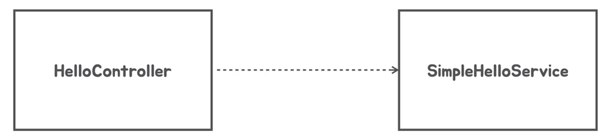
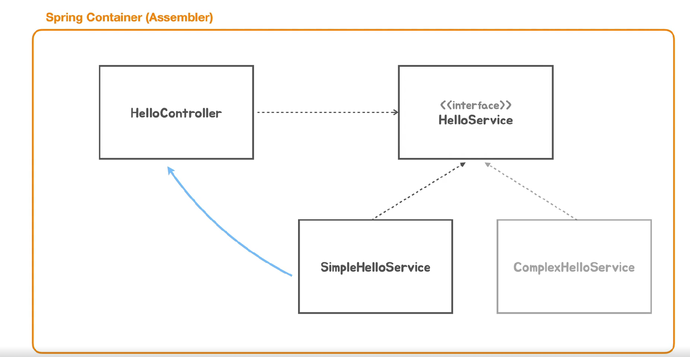
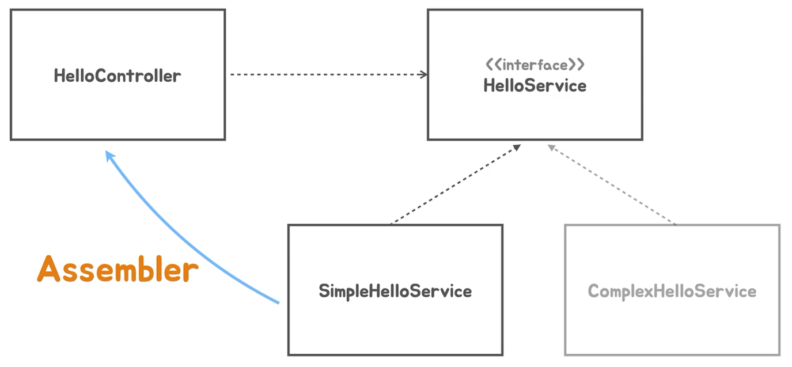

# Dependency Injection - DI  
스프링 컨테이너를 얘기할 때 `Spring IOC`,`Spring DI Container` 라고 합니다.  
<div style="text-align: center;"></div>
HelloController는 HelloService를 의존합니다.  
  
### 의존  
의존이라는 말은 클래스 하나가 기능을 수행할 때 다른 클래스의 속성이나 기능이 없으면  
완벽하게 동작하지 않을 때를 말합니다.  
```java
class HelloController {
    
    public void hello(String name){
        SimpleHelloService service = new SimpleHelloService();
        String result = service.appendLogic(name);
        // :
    }
}
```  
이 처럼 `HelloController`의 `hello()`를 동작하기 위해서  
`HelloService` 클래스의 인스턴스를 사용해야하는 경우에 의존한다고 합니다.  
  
### DI  
이렇게 클래스가 직접 인스턴스를 생성하고 사용하는 관계를 강결합 관계라고 합니다.  
구현체를 직접 의존하고 있기 때문에 컨트롤러는 `SimpleHelloService`의 내부 로직을 전부 알고 있죠  
강결합이 발생 할 경우 어떤 문제가 발생할 까요 ?
```java
class SimpleHelloService {
    String appendLogic(String name) { .. }    
}
class DetaileHelloService {
    User appendDetail(CreateUser user) { .. }
}
```   
이렇게 두 개의 서비스 클래스가 있는데 이제 `DetaileHelloService`의 클래스의 기능으로 변경해야합니다.  
반환 타입이 String에서 User라는 사용자 정의 클래스로 변경되었고  
매개변수 타입도 기본형 타입에서 클래스로 변경되었습니다.  

만약 해당 클래스로 교체한다면 관련된 메소드를 전부 변경해야합니다.  
변경하고, 동작 테스트도 추가로 해야하고, 추가 로직도 작성해야 할 수 있습니다.  
  
시간이 지나고 다른 Service 클래스로 변경해야하는 경우가 생긴다면  
이렇게 강경합으로 묶여있는 경우 코드의 수정이 많아지고 유지보수 비용이 증가합니다.  
  
이렇게 강결합일 경우에 중간에 인터페이스를 사용하여  
`HelloController`가 인터페이스를 의존하게 하면 코드의 수정은 줄어듭니다.  

<div style="text-align: center;"></div> 
  
중간에 인터페이스를 의존하니까 코드의 수정은 어느정도 해결이 되었습니다.  
컨트롤러에서 필요한 서비스를 변경하려면 직접 코드로 들어가 구현체를 변경해야합니다.  
```java
class HelloController {
//    private final HelloService = new SimpleHelloService();
    private final HelloService = new DetailHelloService();
}
```  
클래스 내에서 필요한 의존성을 생성하고 사용한다면,  
의존성이 변경될 때마다 검증 역할을 담당하는 컨트롤러를 수정하게 됩니다.  
  
이런 과정을 대신해서 의존성을 주입해주는 것을 DI라고 합니다.  

스프링 컨테이너는 컨테이너 내에서 사용할 클래스의 인스턴스를 관리도 해주지만,  
인스턴스가 필요한 의존성을 런타임시에 결정해서 주입을 해줍니다.  

<div style="text-align: center;"></div>  
  
스프링 부트가 직접 의존 관계가 없는 클래스들의 오브젝트를 가져다가 서로 관계를 연결해주고  
사용할 수 있도록 만들어주는 역할도 합니다.  
  
직접하면 되는데 왜 그럴까?  
  
의존해야하는 클래스가 많아지고, 관리해야하는 클래스가 많아지면 직접하기가 어렵습니다.  
클래스 내에서도 역할을 나누어 컨트롤러, 서비스 계층을 관리하면 유지보수가 쉽듯이  
비즈니스를 수행하는 클래스와 설정만 담당하는 설정 클래스를 분리해서 사용하게 도와줍니다.