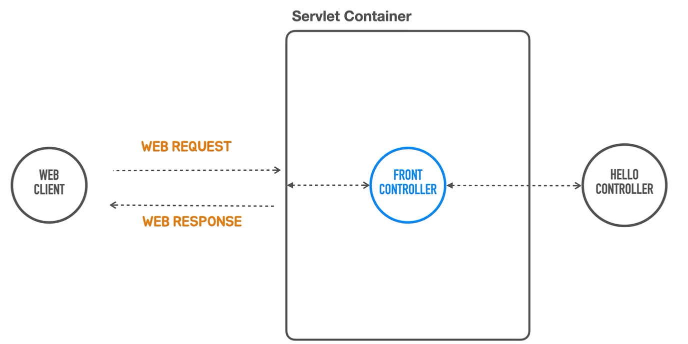
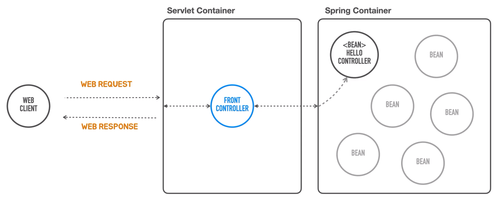
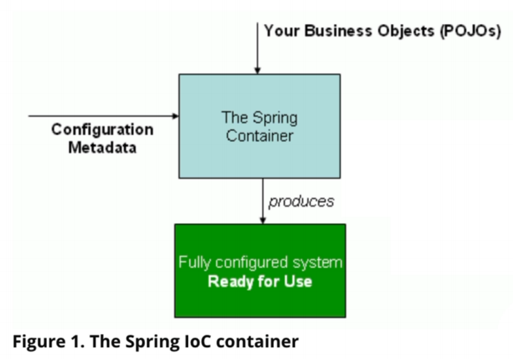

# 스프링 컨테이너 사용  
<div style="text-align: center;"></div>  
  
서블릿 컨테이너를 코드로 띄웠습니다.  
그 다음 서블릿을 모든 요청을 다 받아서 뒤에 있는 오브젝트한테 적절히 매핑해서  
작업을 위임하고 필요하다면 파라미터 같은 것들을 바인딩해서 전달하는 `FrontController`를 만들었습니다.  

<div style="text-align: center;"></div>  
  
이제 HelloController라는 이 오브젝트를 스프링 컨테이너 안에 집어넣어보겠습니다.  
서블릿 컨테이너, 스프링 컨테이너 이제 컨테이너가 두 개가 되었습니다.  
  
그래서 서블릿 컨테이너가 있고 스프링 컨테이너가 있는데 
프론트 컨트롤러가 직접 HelloController의 생명주기를 관리하지 않고,  
스프링 컨테이너를 이용하는 방식으로 변경할 예정입니다.  
  
컨테이너라는건 여러개의 오브젝트를 가지고 있다가 필요할 때 사용할 수 있도록 관리해주는데  
컨테이너 안에 들어가는 저 컴포넌트(`HelloController`)를 우리가 직접 생성했고,  
서블릿 컨테이너 안에 집어 넣어줬습니다.  
아래 코드처럼 서블릿 컨테이너안에 직접 생성한 컨트롤러가 있습니다.
```java
servletContext -> {
    HelloController helloController = new HelloController();
    servletContext.addServlet("frontController", new HttpServlet() {
        @Override
        protected void service(HttpServletRequest req, HttpServletResponse resp) throws ServletException, IOException {
            // 매핑된 클래스에게 위임 로직
        }
    }).addMapping("/*");
}
```

### 스프링 컨테이너  
<div style="text-align: center;"></div>
스프링 컨테이너가 동작하는 것을 설명하는 스프링 문서  

#### 스프링 컨테이너가 생성되기 위해 필요한 2가지  
1. 비즈니스 로직 오브젝트 (`HelloController.hello()`) - `POJO`
    ```
    POJO는 특정 클래스(기술)을 상속하는 방식으로 만들지 않은 
   순수한 Java Object를 말합니다. 즉, 우리의 애플리케이션 코드를 말합니다.
   ```
2. 구성 정보(`Configuration Metadata`)  
   ```
   우리가 만든 POJO 오브젝트를 스프링 컨테이너의 특정 톱니바퀴에 구성할지
   그 구성 정보를 가진 것을 말한다.
   ```  
완전한 구성된 시스템을 만들기 위해 스프링 부트는 `POJO`인 비즈니스 오브젝트와  
비즈니스 오브젝트를 어떻게 구성할지 정보가 담긴 `Metadata`를 가지고 생성한다.  
  
스프링 컨테이너가 코드를 생성하는게 아니라 `Configured system`이 라는 것은  
이미 스프링 컨테이너 안에 있습니다. 둘을 조합해서 시스템을 완성 시키는게 목적이죠  

+ 코드를 잠시 리펙토링합니다.
```java
 servletContext -> {
    servletContext.addServlet("frontController", new HttpServlet() {
        @Override
        protected void service(HttpServletRequest req, HttpServletResponse resp) throws ServletException, IOException {
            String requestURI = req.getRequestURI();
            if(requestURI.equals("/hello") && req.getMethod().equals(HttpMethod.GET.name())){
                String name = req.getParameter("name");
                String result = helloController.hello(name);
                resp.setContentType(MediaType.TEXT_PLAIN_VALUE);
                resp.getWriter().println(result);
            } else if (requestURI.equals("/member")){
                //기타 로직                                
            } else {
                // 등록된 기능이 없다면
                resp.setStatus(HttpStatus.NOT_FOUND.value());
            }
        }
    }).addMapping("/*");
}
```  
+ `응답코드 200`은 정상 동작을 한다면 기본 값으로 설정이 됩니다.
+ `setHeaders` -> `setContentType` 으로 변경합니다.
+ 스프링 컨테이너에 HelloController의 생성을 위임할 예정이기에 생성자 호출를 삭제합니다.  

### 스프링 컨테이너의 역할  
스프링 컨테이너를 대표하는 인터페이스 이름이 있습니다. `ApplicationContext` 입니다.  
애플리케이션을 구성하고 있는 굉장히 많은 정보를 이 컨택스트 안에 어떤 빈에 들어갈지,  
리소스를 접근하는 방법, 내부의 이벤트를 전달하고, 그 이벤트를 구독하는 방법등등  
어플리케이션이라면 필요한 많은 작업들을 수행하는 기능을 담고 있는 오브젝트들이 구현해야하는 인터페이스 입니다.  

+ 전체코드
   ```java
  public static void main(String[] args) {
        GenericApplicationContext applicationContext = new GenericApplicationContext();
        applicationContext.registerBean(HelloController.class);
        applicationContext.refresh();

        ServletWebServerFactory webServerFactory = new TomcatServletWebServerFactory();
        WebServer webServer = webServerFactory.getWebServer(
                servletContext -> {
                    servletContext.addServlet("frontController", new HttpServlet() {
                        @Override
                        protected void service(HttpServletRequest req, HttpServletResponse resp) throws ServletException, IOException {
                            String requestURI = req.getRequestURI();
                            if(requestURI.equals("/hello") && req.getMethod().equals(HttpMethod.GET.name())){
                                String name = req.getParameter("name");
                                HelloController helloController = applicationContext.getBean(HelloController.class);
                                String result = helloController.hello(name);
                                resp.setContentType(MediaType.TEXT_PLAIN_VALUE);
                                PrintWriter writer = resp.getWriter();
                                writer.println(result);
                            } 
                        }
                    }).addMapping("/*");
                }
        );
        webServer.start();
    }
   ```   
코드 하나씩 나누어 설명을 드리겠습니다.  
```java
// 1
GenericApplicationContext applicationContext = new GenericApplicationContext();
// 2
applicationContext.registerBean(HelloController.class);
// 3
applicationContext.refresh();
```  
우리는 예전까지 비즈니스 로직이 담긴 클래스의 인스턴스를 서블릿 컨테이너 안에 `직접 생성`했습니다.  
이제, 스프링 컨테이너를 생성해서 우리가 직접 인스턴스를 생성하는 방식이 아니라,  
위에 그림처럼 POJO 클래스와 구성 정보를 전달해서 대신 인스턴스를 생성하게 할겁니다.  
  
스프링 컨테이너를 대표하는 인터페이스 이름은 `ApplicationContext`입니다.  
해당 인터페스르를 구현하려면 여러 어플리케이션이 필요한 많은 작업들을 수행해주는 기능,  
리소스에 접근하는 방법, 내부의 이벤트가 발생하면 전달하는 방법과 구독하는 방법,  
다양한 클래스를 어떻게 빈(컴포넌트:기능 클래스)으로 만들어서 관리하는지를 구현해야합니다.  

1번 코드는 ApplicationContext중에서 코드로 손쉽게 만들어진 `GenericApplicationContext`의 인스턴스를 생성합니다. 
   
그리고 위에 설명한 것처럼 우리가 아닌 스프링 컨테이너가 POJO 클래스를 목적에 맞는 빈으로 사용하기 위해  
그러면 이 클래스를 빈이라고 스프링 컨텍스트에 전달하고 저장할 수 있게 메세지를 전달해야하는데  
`registerBean()`으로 클래스를 빈으로 등록할 수 있습니다.  
다양한 방법이 있지만 클래스 자체를 등록하는 방식을 많이 사용합니다.  
이렇게 2번까지 진행을 하면 빈 등록이 끝납니다.  
  
3번코드는 이제 다양한 정보와 POJO class를 스프링 컨택스트에 저장했으면  
스프링 컨택스트에게 초기화하는 작업을 수행하는 `refresh()` 메소드를 호출합니다.  
  
```java
// 4
HelloController helloController = applicationContext.getBean(HelloController.class);
// 5
String result = helloController.hello(name);
```  
스프링 컨택스트가 `refresh()`로 초기화가 완료가 되면 내부에 등록한 클래스를 빈으로 관리합니다.  
직접 생성한 오브젝트가 아니기 때문에 스프링 컨택스트에게 필요한 타입의 인스턴스를 요청해야합니다.  
  
4번 방식으로 스프링 컨택스트에게 `getBean()`으로 빈 오브젝트를 가져옵니다.  
빈 오브젝트는 고유 이름(`id`)를 가지고 있고,타입도 가지고 있습니다.  
이름 대신에 클래스 타입을 지정해도 등록된 빈이 있으면 가져올 수 있습니다.  
  
5번 코드로 가져온 오브젝트의 메소드를 사용해서 비즈니스 로직을 수행하면 됩니다.  
