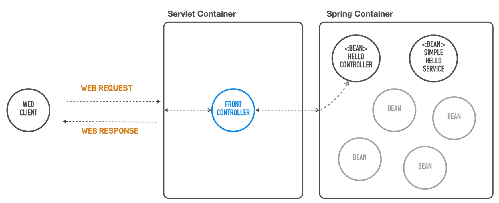

# 스프링 컨테이너 사용  
<div style="text-align: center;"></div>  
  
서블릿 컨테이너를 코드로 띄웠습니다.  
그 다음 서블릿을 모든 요청을 다 받아서 뒤에 있는 오브젝트한테 적절히 매핑해서  
작업을 위임하고 필요하다면 파라미터 같은 것들을 바인딩해서 전달하는 `FrontController`를 만들었습니다.  

<div style="text-align: center;"></div>  
  
이제 HelloController라는 이 오브젝트를 스프링 컨테이너 안에 집어넣어보겠습니다.  
서블릿 컨테이너, 스프링 컨테이너 이제 컨테이너가 두 개가 되었습니다.  
  
그래서 서블릿 컨테이너가 있고 스프링 컨테이너가 있는데 
프론트 컨트롤러가 직접 HelloController의 생명주기를 관리하지 않고,  
스프링 컨테이너를 이용하는 방식으로 변경할 예정입니다.  
  
컨테이너라는건 여러개의 오브젝트를 가지고 있다가 필요할 때 사용할 수 있도록 관리해주는데  
컨테이너 안에 들어가는 저 컴포넌트(`HelloController`)를 우리가 직접 생성했고,  
서블릿 컨테이너 안에 집어 넣어줬습니다.  
아래 코드처럼 서블릿 컨테이너안에 직접 생성한 컨트롤러가 있습니다.
```java
servletContext -> {
    HelloController helloController = new HelloController();
    servletContext.addServlet("frontController", new HttpServlet() {
        @Override
        protected void service(HttpServletRequest req, HttpServletResponse resp) throws ServletException, IOException {
            // 매핑된 클래스에게 위임 로직
        }
    }).addMapping("/*");
}
```

### 스프링 컨테이너  
<div style="text-align: center;"></div>
스프링 컨테이너가 동작하는 것을 설명하는 스프링 문서  

#### 스프링 컨테이너가 생성되기 위해 필요한 2가지  
1. 비즈니스 로직 오브젝트 (`HelloController.hello()`) - `POJO`
    ```
    POJO는 특정 클래스(기술)을 상속하는 방식으로 만들지 않은 
   순수한 Java Object를 말합니다. 즉, 우리의 애플리케이션 코드를 말합니다.
   ```
2. 구성 정보(`Configuration Metadata`)  
   ```
   우리가 만든 POJO 오브젝트를 스프링 컨테이너의 특정 톱니바퀴에 구성할지
   그 구성 정보를 가진 것을 말한다.
   ```  
완전한 구성된 시스템을 만들기 위해 스프링 부트는 `POJO`인 비즈니스 오브젝트와  
비즈니스 오브젝트를 어떻게 구성할지 정보가 담긴 `Metadata`를 가지고 생성한다.  
  
스프링 컨테이너가 코드를 생성하는게 아니라 `Configured system`이 라는 것은  
이미 스프링 컨테이너 안에 있습니다. 둘을 조합해서 시스템을 완성 시키는게 목적이죠  

+ 코드를 잠시 리펙토링합니다.
```java
 servletContext -> {
    servletContext.addServlet("frontController", new HttpServlet() {
        @Override
        protected void service(HttpServletRequest req, HttpServletResponse resp) throws ServletException, IOException {
            String requestURI = req.getRequestURI();
            if(requestURI.equals("/hello") && req.getMethod().equals(HttpMethod.GET.name())){
                String name = req.getParameter("name");
                String result = helloController.hello(name);
                resp.setContentType(MediaType.TEXT_PLAIN_VALUE);
                resp.getWriter().println(result);
            } else if (requestURI.equals("/member")){
                //기타 로직                                
            } else {
                // 등록된 기능이 없다면
                resp.setStatus(HttpStatus.NOT_FOUND.value());
            }
        }
    }).addMapping("/*");
}
```  
+ `응답코드 200`은 정상 동작을 한다면 기본 값으로 설정이 됩니다.
+ `setHeaders` -> `setContentType` 으로 변경합니다.
+ 스프링 컨테이너에 HelloController의 생성을 위임할 예정이기에 생성자 호출를 삭제합니다.  

### 스프링 컨테이너의 역할  
스프링 컨테이너를 대표하는 인터페이스 이름이 있습니다. `ApplicationContext` 입니다.  
애플리케이션을 구성하고 있는 굉장히 많은 정보를 이 컨택스트 안에 어떤 빈에 들어갈지,  
리소스를 접근하는 방법, 내부의 이벤트를 전달하고, 그 이벤트를 구독하는 방법등등  
어플리케이션이라면 필요한 많은 작업들을 수행하는 기능을 담고 있는 오브젝트들이 구현해야하는 인터페이스 입니다.  

+ 전체코드
   ```java
  public static void main(String[] args) {
        GenericApplicationContext applicationContext = new GenericApplicationContext();
        applicationContext.registerBean(HelloController.class);
        applicationContext.refresh();

        ServletWebServerFactory webServerFactory = new TomcatServletWebServerFactory();
        WebServer webServer = webServerFactory.getWebServer(
                servletContext -> {
                    servletContext.addServlet("frontController", new HttpServlet() {
                        @Override
                        protected void service(HttpServletRequest req, HttpServletResponse resp) throws ServletException, IOException {
                            String requestURI = req.getRequestURI();
                            if(requestURI.equals("/hello") && req.getMethod().equals(HttpMethod.GET.name())){
                                String name = req.getParameter("name");
                                HelloController helloController = applicationContext.getBean(HelloController.class);
                                String result = helloController.hello(name);
                                resp.setContentType(MediaType.TEXT_PLAIN_VALUE);
                                PrintWriter writer = resp.getWriter();
                                writer.println(result);
                            } 
                        }
                    }).addMapping("/*");
                }
        );
        webServer.start();
    }
   ```   
코드 하나씩 나누어 설명을 드리겠습니다.  
```java
// 1
GenericApplicationContext applicationContext = new GenericApplicationContext();
// 2
applicationContext.registerBean(HelloController.class);
// 3
applicationContext.refresh();
```  
우리는 예전까지 비즈니스 로직이 담긴 클래스의 인스턴스를 서블릿 컨테이너 안에 `직접 생성`했습니다.  
이제, 스프링 컨테이너를 생성해서 우리가 직접 인스턴스를 생성하는 방식이 아니라,  
위에 그림처럼 POJO 클래스와 구성 정보를 전달해서 대신 인스턴스를 생성하게 할겁니다.  
  
스프링 컨테이너를 대표하는 인터페이스 이름은 `ApplicationContext`입니다.  
해당 인터페스르를 구현하려면 여러 어플리케이션이 필요한 많은 작업들을 수행해주는 기능,  
리소스에 접근하는 방법, 내부의 이벤트가 발생하면 전달하는 방법과 구독하는 방법,  
다양한 클래스를 어떻게 빈(컴포넌트:기능 클래스)으로 만들어서 관리하는지를 구현해야합니다.  

1번 코드는 ApplicationContext중에서 코드로 손쉽게 만들어진 `GenericApplicationContext`의 인스턴스를 생성합니다. 
   
그리고 위에 설명한 것처럼 우리가 아닌 스프링 컨테이너가 POJO 클래스를 목적에 맞는 빈으로 사용하기 위해  
그러면 이 클래스를 빈이라고 스프링 컨텍스트에 전달하고 저장할 수 있게 메세지를 전달해야하는데  
`registerBean()`으로 클래스를 빈으로 등록할 수 있습니다.  
다양한 방법이 있지만 클래스 자체를 등록하는 방식을 많이 사용합니다.  
이렇게 2번까지 진행을 하면 빈 등록이 끝납니다.  
  
3번코드는 이제 다양한 정보와 POJO class를 스프링 컨택스트에 저장했으면  
스프링 컨택스트에게 초기화하는 작업을 수행하는 `refresh()` 메소드를 호출합니다.  
  
```java
// 4
HelloController helloController = applicationContext.getBean(HelloController.class);
// 5
String result = helloController.hello(name);
```  
스프링 컨택스트가 `refresh()`로 초기화가 완료가 되면 내부에 등록한 클래스를 빈으로 관리합니다.  
직접 생성한 오브젝트가 아니기 때문에 스프링 컨택스트에게 필요한 타입의 인스턴스를 요청해야합니다.  
  
4번 방식으로 스프링 컨택스트에게 `getBean()`으로 빈 오브젝트를 가져옵니다.  
빈 오브젝트는 고유 이름(`id`)를 가지고 있고,타입도 가지고 있습니다.  
이름 대신에 클래스 타입을 지정해도 등록된 빈이 있으면 가져올 수 있습니다.  
  
5번 코드로 가져온 오브젝트의 메소드를 사용해서 비즈니스 로직을 수행하면 됩니다.  

### 지금까지 정리  
스프링 컨테이너를 코드로 인스턴스를 생성을하고, 스프링 컨테이너에게 우리가 필요로 하는 클래스와 구성정보를  
전달하고 초기화를 했습니다. 그리고 스프링 컨테이너가 관리하는 빈 오브젝트를 `getBean()`메서드를 통해서  
반환된 오브젝트를 사용하는 방식으로 전환을 했습니다.  
  
그러면 프론트 컨트롤러가 직접 `new`를 사용해서 오브젝트를 생성하는 것과 무슨 차이가 있을까?  
스프링 컨테이너가 서블릿 컨테이너 코드 앞에 추가가 되었고,코드는 더 복잡해졌습니다.  
  
대신, 스프링 컨테이너가 할 수 있는 중요한 일을 사용할 수 있게 기본 구조를 작성했습니다.  

스프링 컨테이너는 기본적으로 내부에서 인스턴스를 생성할 때 딱 한번만 만듭니다.  
스프링 컨테이너가 관리하는 빈을 여러 오브젝트에서 필요로 할 수 있습니다.  
  
만약 다른 서블릿을 생성하고 `HelloController.hello()`기능이 추가로 필요하다고 할 때,  
그럴때 마다 새로운 `HelloController` 오브젝트를 다시 만들어 전달하는 방법이 아니라  
이미 스프링 컨테이너가 만들어놓은 `HelloController`빈을 계속 반환하면 됩니다.  
  
이렇게 한 번만 생성하는 방식을 사용하게 되면  
FrontController와 다른 서블릿이 같은 `HelloController`의 인스턴스를 사용하게 됩니다.  
이런 싱글톤 패턴을 사용한 것과 유사하게 스프링 컨테이너에 등록한 오브젝트를 한 번만 생성하고,  
필요로 할 때마다 재사용할 수 있게 해주는 기능을 스프링 컨테이너가 제공합니다.  
  
**_그래서 스프링 컨테이너를 싱글톤 레지스트리 라고 합니다._**  
  
`HelloController` 클래스 하나로 하나의 요청을 처리할 수 있지만,  
역할이 무거워지게 되면, 역할을 분리해야하는 경우가 발생합니다.  
<div style="text-align: center;"></div>  
  
`Controller`는 기본적으로 웹 컨트롤러이기 때문에 웹을 통해서 들어온  
클라이언트의 요청사항을 한번 검증하고 이걸 뒤에 비즈니스 로직을 제공해주는  
다른 오브젝트에게 요청을 보내서 결과를 다시 클라이언트에게 어떤 형식을 돌려줄지 결정하는  
역할을 합니다.  
그러면 단일 책임을 하게 되니까 유지보수도 간단해집니다  
  
코드로 간단하게 살펴보겠습니다.  
```java
public class HelloController {

    public String hello(String name) {
        SimpleHelloService helloService = new SimpleHelloService();
        // 방법 1
        if (name == null) {
            throw new IllegalArgumentException("값이 비어있습니다.");
        }
        // 방법 2 - null -> exception
        return helloService.sayHello(Objects.requireNonNull(name));
    }
}
```  
컨트롤러는 웹 클라이언트의 요청이 들어왔는지 검증을 하고, 실제 비즈니스 로직을 수행하는 것은  
서비스 클래스에게 전달합니다. 반환되는 값을 클라이언트와 약속한 API형식이나 HTML 형식으로 변환후  
반환하는 역할입니다.  
  
```java
public class SimpleHelloService {
    String sayHello(String name) {
        return "Hello "+name;
    }
}
```  
우리가 정한 비즈니스 로직을 수행하고, 그 결과를 반환하는 클래스입니다.  
이렇게 역할 분담을 하게되면 유지보수도 편해지고, 코드를 읽기도 편합니다.  
  
#### 역할 분담을 하는게 왜 좋을까?
```java
public class HelloController {

    public String hello(String name) {
        // 검증
        if (name == null) {
            throw new IllegalArgumentException("값이 비어있습니다.");
        }
        
        // 비즈니스 로직
        String result = name + " : 시간 ";
        result += "이것 저것 추가 로직이 들어감";  
        
        // 비즈니스 로직을 영구 저장하는 요청사항이 있음 
        String sql = "INSERT INTO USERS VALUES (?)";
        // .. :
        
        // 저장후 사용자에게 반환할 때는 클라이언트와 약속한 값으로 반환해야함
        return ResponseUserDto(name,"이것저것");   
    }
}
```  
코드가 몇줄 안될때는 큰 문제가 발생하지 않지만,  
시간이 지나서 길어지고 추가 요구사항이나 검증이 발생하면  
`검증`을 수정할 때도 `hello()`를 수정해야하고,  
`비즈니스` 로직을 수정할때도 `hello()`를 수정을 해야하고,  
`SQL`이나 `JPA`를 수정할 때도 `hell()`를 수정해야합니다.  
  
첫 번째는  
그러면 검증을 수정하는 개발자와 비즈니스 로직을 수정하는 개발자가 코드를 수정하고  
커밋을 하게 되면 충돌이 발생하고, 그 충돌을 해결하는 추가 시간이 발생합니다.  
  
두 번째는 
코드를 이해하기 위해서 주석을 추가하거나, 코드를 처음부터 읽어야 하고  
만약 컨트롤러에서 받아야 하는 데이터 타입이 변경되거나 수정될 경우에는  
그 이하 코드를 전부 수정해야하는 상황이 발생 할 수 있습니다.  
  
따라서 하나의 클래스가 하나의 책임( 검증, 저장, 비즈니스 로직, 외부 리소스 사용)등을 나누는 것이  
유지보수를 더 쉽게 해줍니다.