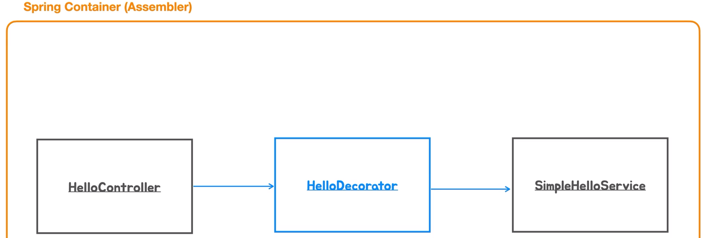

# DI를 이용한 Decorator,Proxy 패턴  
<div style="text-align: center;"></div>  
  
HelloController를 테스트하기 위해서 HelloController가 의존하는 HelloService를 직접 만들어서 주입했습니다.
```Java
void nameIsEmptyThrowEx(){
    //given
    String name = null;
    HelloController helloController = new HelloController(new HelloService() {
        @Override
        public String sayHello(String requestName) {
            return requestName;
        }
    });
}
```  
이렇게 스프링 컨테이너를 사용하지 않고 클래스외에서 주입하는 방법도 DI(`Dependency Injection`)의 일종입니다.  
강결합인 상태에서 결합도를 낮추고 HelloService를 변경해도 HelloController의 코드에 영향이 없도록 
HelloService라는 인터페이스를 의존하게 했습니다.  
  
스프링 컨테이너는 HelloService를 구현한 클래스를 DI의 Assembler 역할을 하여 두 클래스를 런타임시에 의존관계를 주입해줍니다.  
동적으로 변경하려면 개발자는 스프링 컨테이너에게 사용하겠다는 구현 클래스의 대한 정보를 넘겨주면 됩니다.  

<div style="text-align: center;"></div>  

정식으로 클래스를 만들어서 HelloServiceTestStub 처럼 테스트 목적으로 만들 수도 있습니다.  
  
이번 장에서는 `HelloDecorator`입니다.  
<div style="text-align: center;"></div>  
  
Decorator 클래스는 HelloService를 구현하면서 동시에 HelloService 타입의 오브젝트를 의존하게 만듭니다.  
이런 구조로 만들면 HelloDecorator는 HelloService를 구현한 다른 오브젝트를 호출할 수 있습니다.  
  
이런 구조를 만드는 이유는 `DI`를 사용해서 런타임 시에 이런 구조를 만들어 낼 수 있습니다.  
<div style="text-align: center;"></div>  
  
SimpleHelloService는 메인 비즈니스 로직을 가지고 있는 실제 HelloSerbice의 기능을 제공하는 오브젝트입니다. 
해당 클래스를 건들지 않고 추가로 어떠한 역할이나 책임, 기능을 추가해야할 때 사용합니다.  
  
이렇게 구조를 만들려면 스프링 컨테이너에게 구성 정보를 전달하면 됩니다. 

지금까지는 스프링 컨테이너에게 구성 정보를 전달할 때 특정 클래스를 `DI`하기 위해 
명시적으로 작성하여 전달하지 않았습니다.  
정상적으로 동작한 이유는 `HelloService`를 스프링 컨테이너가 찾을 때 해당 인터페이스를 구현한 
빈 오브젝트를 찾아보고 만약에 한 개의 빈 오브젝트만 있으면 그걸 주입해 줍니다.  
이런 방식을 **autowiring** 이라고 합니다.  
  
`@Autowire`  
생성자를 통해서 주입하든, 빈 오브젝트 타입의 정보를 가지고 후보를 찾아서 자동으로 등록해달라는 요청 애노테이션 입니다. 
스프링 4.3부터 해당 어노테이션을 생략해도 생성자가 하나라면 파라미터 타입과 일치하는 빈을 찾아서 생성자에 자동으로 주입해줍니다.  
  
하지만, `HelloDecorator`를 빈 오브젝트에 등록하면 기존과는 다른 방식으로 `DI`를 해야합니다.  
<div style="text-align: center;"></div>  
  
컨트롤러가 데코레이터를 의존하고 데코레이터는 실제 비즈니스 오브젝트를 의존하게 구성해야합니다. 
  
컨트롤러 입장에서는 HelloService 인터페이스를 구현한 오브젝트가 데코레이터 종류인지 아니면 비즈니스 로직을 
담고있는 메인 클래스인지 구분하지 않습니다. 의존하는 인터페이스 타입의 인터페이스 메소드를 사용할 뿐입니다.  
```Java
@Service
@Primary
public class HelloDecoretor implements HelloService {
    private final HelloService helloService;

    public HelloDecoretor(HelloService helloService) {
        this.helloService = helloService;
    }

    @Override
    public String sayHello(String name) {
        if(name == null || name.isBlank()){
            throw new IllegalArgumentException("Name cannot be null or blank");
        }
        String result = helloService.sayHello(name);
        return String.format("* %s *", result);
    }
}
```  
그리고 해당 클래스위에 애노테이션으로 무슨 역할을 하는지 표시를 합니다.
  
현재 HelloService를 구현한 빈 오브젝트는 `HelloDecorator`와 `SimpleHelloService`가 있습니다. 
스프링 컨테이너는 두 빈 오브젝트중 하나를 개발자에게 선택이나 우선순위를 부여하라고 예외를 던집니다.  
  
이때 해결할 수 있는 방법이 2개가 있습니다. 
1. xml이나 자바 설정 방법을 통해 의존관계 순서를 정할 수 있습니다. 
2. `@Primary` 애노테이션을 추가하여 우선순위를 지정할 수 있습니다.  
  
컨트롤러에서는 `@Primary`가 붙은 데코레이터가 주입이 됩니다. 데코레이터는 자기 자신을 제외한 
`HelloService`를 구현한 빈 오브젝트는 하나 밖에 없기 때문에 빈 오브젝트 주입이 정상 완료됩니다.  
  
데코레이터는 기존 비즈니스 클래스의 코드를 수정하지 않고 책임을 추가하는 클래스입니다.  
